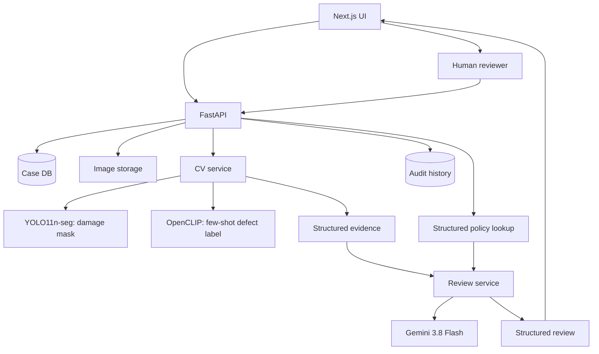

# ReturnReview Architecture

## Evidence boundary

ReturnReview deliberately separates perception from reasoning:

1. **Computer vision observes** visible evidence.
2. **Evidence records** store model version, confidence and regions.
3. **Policy service provides facts** from structured policy records.
4. **LLM interprets** only the evidence + case metadata + policy.
5. **Human reviewer decides** approve/reject/request-more-evidence.

## Runtime architecture

## Safety design

- No final operational decision is delegated to the LLM.
- LLM receives structured evidence, not authority to invent image findings.
- Database writes are deterministic backend actions, not autonomous model tools.
- CV inference refuses to claim success if no trained checkpoint exists.
- Evaluation UI reads persisted metric artifacts and never fabricates numbers.
